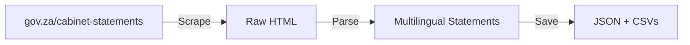
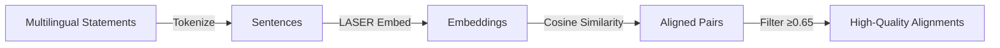

# Gov-ZA Multilingual Cabinet Statements

<div align="center">

[](https://github.com/dsfsi/gov-za-multilingual/actions/workflows/sentence_alignment_build.yml)
[](https://doi.org/10.5281/zenodo.7635167)
[](https://arxiv.org/abs/2303.03750)
[](LICENSE_data.md)
[](LICENSE)

**A sentence-aligned multilingual corpus of South African government cabinet statements in 11 official languages**

[🤗 Dataset](https://huggingface.co/datasets/dsfsi/govza-sa-cabinet-statements-sentence-aligned) • [📄 Paper](https://arxiv.org/abs/2303.03750) • [🗂️ Zenodo](https://doi.org/10.5281/zenodo.7635168) • [📊 Explore Data](https://lite.datasette.io/?json=https%3A%2F%2Fraw.githubusercontent.com%2Fdsfsi%2Fgov-za-multilingual%2Fmaster%2Fdata%2Fgovza-cabinet-statements.json) • [📝 Feedback](https://docs.google.com/forms/d/e/1FAIpQLSf7S36dyAUPx2egmXbFpnTBuzoRulhL5Elu-N1eoMhaO7v10w/formResponse)

</div>

---

## 📚 Table of Contents

- [About](#-about)
- [Dataset](#-dataset)
- [Quick Start](#-quick-start)
- [Using the Dataset](#-using-the-dataset)
- [Development](#-development)
- [Pipeline Architecture](#-pipeline-architecture)
- [Alignment Statistics](#-alignment-statistics)
- [Citation](#-citation)
- [License](#-license)
- [Contributors](#-contributors)

---

## 🌍 About

This repository contains **sentence-aligned parallel text** from South African government cabinet statements in **11 official languages**. The data is scraped from [gov.za/cabinet-statements](https://www.gov.za/cabinet-statements), maintained by the [Government Communication and Information System (GCIS)](https://www.gcis.gov.za/).

### Key Features

- 🌐 **724,694 aligned sentence pairs** across 55 language combinations
- 🔗 **Sentence-level alignment** using LASER embeddings
- 📈 **High-quality alignments** with confidence scores (cosine similarity ≥ 0.65)
- 🎯 **Ready-to-use splits** (train/test/eval) for machine learning
- 🚀 **Automated pipeline** with GitHub Actions for continuous updates
- 🤗 **Available on Hugging Face** for easy integration

### Supported Languages

<table>
<tr>
<td>

| Language | Code |
|----------|------|
| English | `eng` |
| Afrikaans | `afr` |
| isiNdebele | `nbl` |
| isiXhosa | `xho` |
| isiZulu | `zul` |
| Sesotho | `sot` |

</td>
<td>

| Language | Code |
|----------|------|
| Sepedi | `nso` |
| Setswana | `tsn` |
| Siswati | `ssw` |
| Tshivenda | `ven` |
| Xitstonga | `tso` |
| | |

</td>
</tr>
</table>

---

## 📦 Dataset

### Hugging Face Datasets 🤗

The sentence-aligned dataset is available on Hugging Face for easy integration with ML workflows:

```python
from datasets import load_dataset

# Load a specific language pair
dataset = load_dataset("dsfsi/govza-sa-cabinet-statements-sentence-aligned", "afr-eng")

# Access splits
train_data = dataset["train"]  # ~70% of data
test_data = dataset["test"]    # ~15% of data
eval_data = dataset["eval"]    # ~15% of data

# Iterate through examples
for example in train_data:
    print(f"Afrikaans: {example['afr']}")
    print(f"English: {example['eng']}")
    print(f"Alignment Score: {example['score']:.2f}")
```

**Available configurations:** 55 language pair combinations (e.g., `afr-eng`, `xho-zul`, `eng-nso`)

👉 **[View on Hugging Face](https://huggingface.co/datasets/dsfsi/govza-sa-cabinet-statements-sentence-aligned)**

### Raw Data

The raw multilingual cabinet statements are also available:

- **Full dataset:** `data/govza-cabinet-statements.json` (all languages combined)
- **Per-language CSVs:** `data/interim/govza-cabinet-statements-{lang}.csv`
- **Aligned outputs:** `data/sentence_align_output/` (JSONL format with scores)

---

## 🚀 Quick Start

### Prerequisites

- **For scraping:** Python 3.8+ (any OS)
- **For sentence alignment:** Ubuntu 20.04 + Python 3.8 (required for fairseq)

### Installation

**Option 1: Automated Setup (Recommended)**

```bash
./setup.sh
```

This interactive script will:
- ✅ Verify Python 3.8 installation
- ✅ Install system dependencies (Ubuntu)
- ✅ Install Python packages
- ✅ Fix LASER script line endings
- ✅ Set up development tools (optional)

**Option 2: Using Makefile**

```bash
make setup
```

**Option 3: Manual Setup**

```bash
# Install dependencies
pip install -r requirements.txt

# For Ubuntu: Install system packages
sudo apt-get update
sudo apt-get install build-essential cmake zip

# For development
pip install -r requirements-dev.txt
pre-commit install
```

### Running the Pipeline

```bash
# Scrape new cabinet statements
make scrape

# Run sentence alignment
make align

# View all commands
make help
```

---

## 💻 Using the Dataset

### Training a Translation Model

```python
from datasets import load_dataset
from transformers import MarianMTModel, MarianTokenizer, Trainer

# Load Afrikaans-English data
dataset = load_dataset(
    "dsfsi/govza-sa-cabinet-statements-sentence-aligned",
    "afr-eng"
)

# Your training code here
# ...
```

### Filtering by Alignment Quality

```python
# Load dataset
dataset = load_dataset("dsfsi/govza-sa-cabinet-statements-sentence-aligned", "afr-eng")

# Filter high-quality alignments (score ≥ 0.8)
high_quality = dataset["train"].filter(lambda x: x["score"] >= 0.8)

print(f"High-quality pairs: {len(high_quality)}")
```

### Exploring Alignment Statistics

See the [Alignment Statistics](#-alignment-statistics) section below for detailed statistics on alignment quality and coverage across language pairs.

---

## 🛠️ Development

### Project Structure

```
gov-za-multilingual/
├── data/                          # Dataset files
│   ├── govza-cabinet-statements.json
│   ├── interim/                   # Per-language CSVs
│   ├── sentence_align_output/     # Aligned pairs (JSONL)
│   └── opt_aligned_out/           # Optimized alignments
├── src/
│   ├── gov_cab_statements_scrape/ # Web scraper
│   ├── sentence_alignment/        # LASER-based alignment
│   └── scripts/                   # Utility scripts
├── huggingface_dataset/           # HF dataset preparation
├── notebooks/                     # Jupyter notebooks
├── .github/workflows/             # Automated CI/CD
├── setup.sh                       # Automated setup script
├── Makefile                       # Common commands
└── README.md                      # This file
```

### Development Workflow

1. **Make changes** to scraping or alignment code
2. **Run tests** (when available): `pytest`
3. **Check code quality:**
   ```bash
   make lint              # Run flake8
   pre-commit run --all   # Run all pre-commit hooks
   ```
4. **Commit changes:** The pre-commit hooks will automatically format code

### Contributing

We welcome contributions! Please:

1. Fork the repository
2. Create a feature branch: `git checkout -b feature/amazing-feature`
3. Make your changes and commit: `git commit -m 'Add amazing feature'`
4. Push to your fork: `git push origin feature/amazing-feature`
5. Open a Pull Request

**See also:**
- [CLAUDE.md](CLAUDE.md) - Architecture and development guide
- [QOL_IMPROVEMENTS.md](QOL_IMPROVEMENTS.md) - Recent improvements

---

## 🏗️ Pipeline Architecture

### Data Collection



**Scraper** (`src/gov_cab_statements_scrape/`):
- Runs weekly via GitHub Actions (Fridays at 2pm UTC)
- Extracts statements in all 11 languages
- Outputs to `data/govza-cabinet-statements.json`

### Sentence Alignment



**Alignment Pipeline** (`src/sentence_alignment/`):
1. **Tokenization:** NLTK sentence tokenization
2. **Preprocessing:** Language-specific cleaning (URLs, titles, etc.)
3. **Embedding:** LASER (Language-Agnostic SEntence Representations)
4. **Alignment:** Cosine similarity of sentence embeddings
5. **Filtering:** Keep pairs with score ≥ 0.65

### Automated Workflows

Two GitHub Actions workflows maintain the dataset:

1. **Weekly Scraping** (`.github/workflows/update_cab_statements.yml`)
   - Runs every Friday at 14:00 UTC
   - Scrapes new statements
   - Commits data files

2. **Sentence Alignment** (`.github/workflows/sentence_alignment_build.yml`)
   - Triggers after scraping completes
   - Aligns new statements across all language pairs
   - Uses Python 3.8 + pip 24.0 (fairseq compatibility)

---

## 📊 Alignment Statistics

### Overall Statistics

- **Total aligned pairs:** 724,694
- **Language pairs:** 55 combinations
- **Average alignment score:** 0.78 (median: 0.81)
- **Quality threshold:** Cosine similarity ≥ 0.65

### Top 20 Language Pairs by Volume

<details>
<summary>Click to expand</summary>

| Source | Target | Aligned Pairs | Avg Score |
|--------|--------|--------------|-----------|
| nbl | ven | 18,984 | 0.75 |
| nso | ssw | 18,697 | 0.82 |
| zul | ssw | 18,563 | 0.84 |
| xho | ssw | 18,387 | 0.83 |
| xho | zul | 18,145 | 0.85 |
| xho | nso | 18,110 | 0.83 |
| xho | tso | 17,954 | 0.81 |
| ssw | tso | 17,880 | 0.82 |
| zul | tso | 17,789 | 0.82 |
| zul | nso | 17,630 | 0.83 |
| nso | tso | 17,617 | 0.81 |
| tsn | tso | 16,681 | 0.80 |
| xho | tsn | 16,571 | 0.81 |
| xho | eng | 16,537 | 0.84 |
| zul | tsn | 16,482 | 0.81 |
| tsn | ssw | 16,386 | 0.81 |
| nso | tsn | 16,179 | 0.80 |
| nbl | sot | 16,163 | 0.73 |
| zul | eng | 16,149 | 0.84 |
| tso | eng | 16,068 | 0.82 |

</details>

### Alignment Quality Distribution

- **Excellent (≥ 0.9):** ~15% of pairs
- **Good (0.8-0.89):** ~45% of pairs
- **Fair (0.7-0.79):** ~30% of pairs
- **Acceptable (0.65-0.69):** ~10% of pairs

---

## 📖 Citation

If you use this dataset in your research, please cite:

### Paper

```bibtex
@inproceedings{lastrucci-etal-2023-preparing,
    title = "Preparing the Vuk{'}uzenzele and {ZA}-gov-multilingual {S}outh {A}frican multilingual corpora",
    author = "Lastrucci, Richard and Dzingirai, Isheanesu and Rajab, Jenalea and
              Madodonga, Andani and Shingange, Matimba and Njini, Daniel and Marivate, Vukosi",
    booktitle = "Proceedings of the Fourth workshop on Resources for African Indigenous Languages (RAIL 2023)",
    month = may,
    year = "2023",
    address = "Dubrovnik, Croatia",
    publisher = "Association for Computational Linguistics",
    url = "https://aclanthology.org/2023.rail-1.3",
    pages = "18--25"
}
```

### Dataset

```bibtex
@dataset{marivate_vukosi_2023_7635168,
  author    = {Marivate, Vukosi and Shingange, Matimba and Lastrucci, Richard and
               Dzingirai, Isheanesu and Rajab, Jenalea},
  title     = {The South African Gov-ZA multilingual corpus},
  month     = feb,
  year      = 2023,
  publisher = {Zenodo},
  version   = {1.0},
  doi       = {10.5281/zenodo.7635168},
  url       = {https://doi.org/10.5281/zenodo.7635168}
}
```

---

## 📄 License

- **Data:** [Creative Commons Attribution 4.0 International (CC BY 4.0)](LICENSE_data.md)
- **Code:** [MIT License](LICENSE)

---

## 👥 Contributors

### Core Team

- **Vukosi Marivate** ([@vukosi](https://twitter.com/vukosi)) - Project Lead
- **Matimba Shingange** - Data Collection & Processing
- **Richard Lastrucci** - Sentence Alignment Pipeline
- **Isheanesu Joseph Dzingirai** - Infrastructure & Automation
- **Jenalea Rajab** - Data Analysis & Validation

### Organization

**Data Science for Social Impact (DSFSI) Research Group**
University of Pretoria, South Africa

---

## ⚠️ Disclaimer

This dataset contains machine-readable data extracted from online cabinet statements from the South African government (GCIS). While efforts were made to ensure accuracy and completeness, there may be errors or discrepancies. No warranties or guarantees are provided. Users should verify information before making decisions based on this data.

---

## 🔗 Related Resources

- 🤗 **Hugging Face Dataset:** [dsfsi/govza-sa-cabinet-statements-sentence-aligned](https://huggingface.co/datasets/dsfsi/govza-sa-cabinet-statements-sentence-aligned)
- 📄 **Paper:** [arXiv:2303.03750](https://arxiv.org/abs/2303.03750)
- 🗂️ **Zenodo Archive:** [DOI: 10.5281/zenodo.7635168](https://doi.org/10.5281/zenodo.7635168)
- 📊 **Interactive Explorer:** [Datasette Lite](https://lite.datasette.io/?json=https%3A%2F%2Fraw.githubusercontent.com%2Fdsfsi%2Fgov-za-multilingual%2Fmaster%2Fdata%2Fgovza-cabinet-statements.json)
- 🌐 **DSFSI:** [dsfsi.github.io](https://dsfsi.github.io/)

---

<div align="center">

**[⬆ Back to Top](#gov-za-multilingual-cabinet-statements)**

Made with ❤️ by the DSFSI Research Group

</div>
